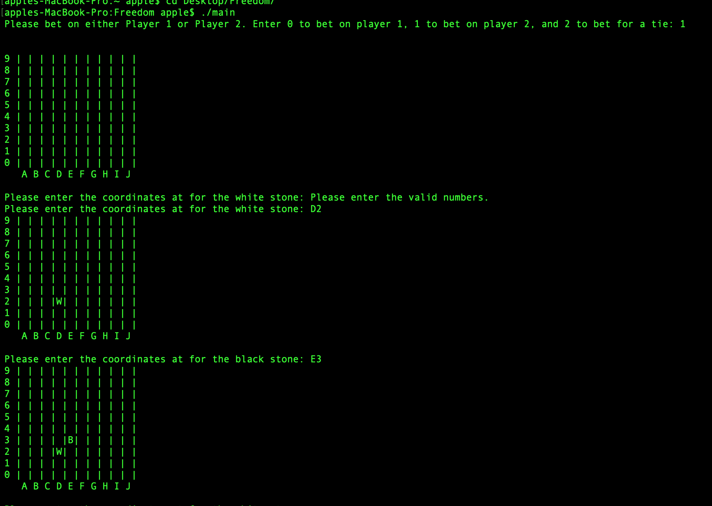

# Freedom

Made the Freedom board game on a 10x10 board where the user is prompted to place white stones (for player 1) and black stones (for player 2) on the board per the given instructions. 

The type of stone which has more "live stones", i.e. a part of some horizontal, vertical or diagonal row of exactky 4 stones of the same color, wins

## Installation

Execute the following commands to run the game:
```
git clone https://github.com/hshastri/Freedom.git
cd Freedom
sudo gcc -o main main.c
./main
```

## Game demo
 This is how the game starts
 



main() basically prints prints out the initial board and calls the play function. 

void printBoard(char** board, int length): prints out the board on the screen of given length.

int bounds(char** board, int length, int x, int y): checks if the coordinates entered are the user are out of bounds and if they are it returns 0 and 1 otherwise.

int getX(char coordinates[]): the user enters the coordinates in form of an array of two characters (for example, B2), and this function returns the X coordinate corresponding to the first element in the character array.
int getY(char coordinates[]): just like getX, it return the Y coordinate.

void placeWhite(char** board, int length, int x, int y): Places the white stone on the board.

void placeBlack(char** board, int length, int x, int y): Places the black stone on the board.

int adjacent(char** board, int length, int a, int b, int x, int y): returns 1 if (a,b) is adjacent to (x,y) and 0 otherwise.

void play(char** board, int length, int whoseTurn): this is where the game logic is implemented. whoseTurn is basically which player makes the first move-0 is for the white stone and 1 is for the black stone.

int spotFilled(char** board, int length, int x, int y): Checks is the user is entering the coordinates where the spots adjacent are filled- 1 if filled and 0 otherwise.

int spotEmpty(char** board, int length, int x, int y): return 1 if the spot is filled and 0 otherwise.

int rowCheck(char** board, int length, char player): checks live stones in rows for a particular player.
 
int columnCheck(char** board, int length, char player): checks live stones in columns for a particular player.

int diagonalCheck(char** board, int length, char player): checks live stones in diagonals for a particular player.

void testPrintBoard(char** board, int length): It's a test board which checks if the winning conditions work well or not.
