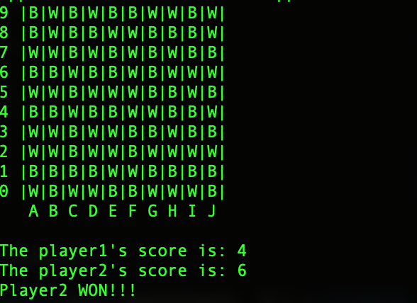

# Freedom

Made the Freedom board game on a 10x10 board where the user is prompted to place white stones (for player 1) and black stones (for player 2) on the board per the given instructions. 

The type of stone which has more "live stones", i.e. a part of some horizontal, vertical or diagonal row of exactky 4 stones of the same color, wins

## Installation

Execute the following commands to run the game:
```
git clone https://github.com/hshastri/Freedom.git
cd Freedom
sudo gcc -o main main.c
./main
```

## Game demo
 This is how the game starts
 


You should see this upon completion of the game:


